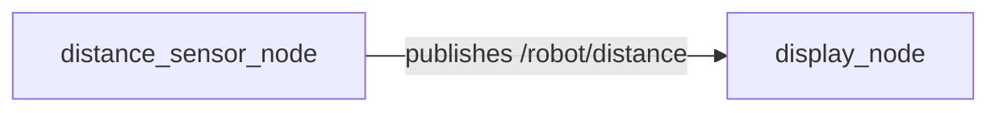
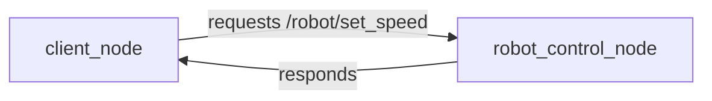

# ROS 2 Architecture: Nodes, Topics, and Services

ROS 2 (Robot Operating System 2) provides a standardized framework for robotic application development. It enables modularity, reusability, and robust communication between different components of a robotic system. At its core, ROS 2 relies on a distributed communication architecture built around nodes, topics, services, and actions.

## Nodes: The Building Blocks

A **node** is an executable process that performs computations. In a ROS 2 system, multiple nodes can run concurrently, each responsible for a specific task (e.g., a camera driver node, a navigation node, a motor control node). Nodes are typically implemented as independent programs.

## Topics: Asynchronous Data Streaming

**Topics** are the most common way for nodes to exchange data in a publish/subscribe model.

-   **Publishers**: Nodes that send data to a topic.
-   **Subscribers**: Nodes that receive data from a topic.

This communication is asynchronous; publishers send data without knowing if any subscribers are listening, and subscribers receive data whenever it is published. Data is typed, meaning all messages on a given topic adhere to a predefined message structure.

### Example: Publisher and Subscriber

Imagine a robot with a distance sensor and a display unit. A `distance_sensor_node` could publish distance readings to a topic `/robot/distance`, and a `display_node` could subscribe to this topic to show the readings.

## Services: Synchronous Request/Response

**Services** enable synchronous communication between nodes in a request/response pattern. A client node sends a request to a service server node and waits for a response. This is useful for tasks that require an immediate result, like querying a specific piece of information or triggering a one-shot action.

-   **Service Server**: A node that offers a service and processes requests.
-   **Service Client**: A node that sends requests to a service server.

### Example: Service Client and Server

A `robot_control_node` might offer a service `/robot/set_speed` where a client can request a specific speed for the robot. The `robot_control_node` would then execute the command and return a success/failure response.

## Actions: Long-Running Tasks with Feedback

**Actions** are designed for long-running tasks that require continuous feedback and the ability to be preempted (cancelled). They build upon services and topics to provide a more robust mechanism for complex, goal-oriented behaviors.

-   **Action Client**: Sends a goal, receives continuous feedback, and eventually a result.
-   **Action Server**: Receives goals, processes them, sends feedback, and returns a final result.

### Example: Action Client and Server

If a robot needs to navigate to a specific `waypoint`, an `action_client_node` could send a goal to a `navigation_action_server`. The server would provide feedback on the robot's progress (e.g., current position), and the client could cancel the goal if needed, eventually receiving a final result (e.g., `success` or `aborted`).

Understanding these core communication concepts is fundamental to designing and implementing robust robotic applications with ROS 2.
